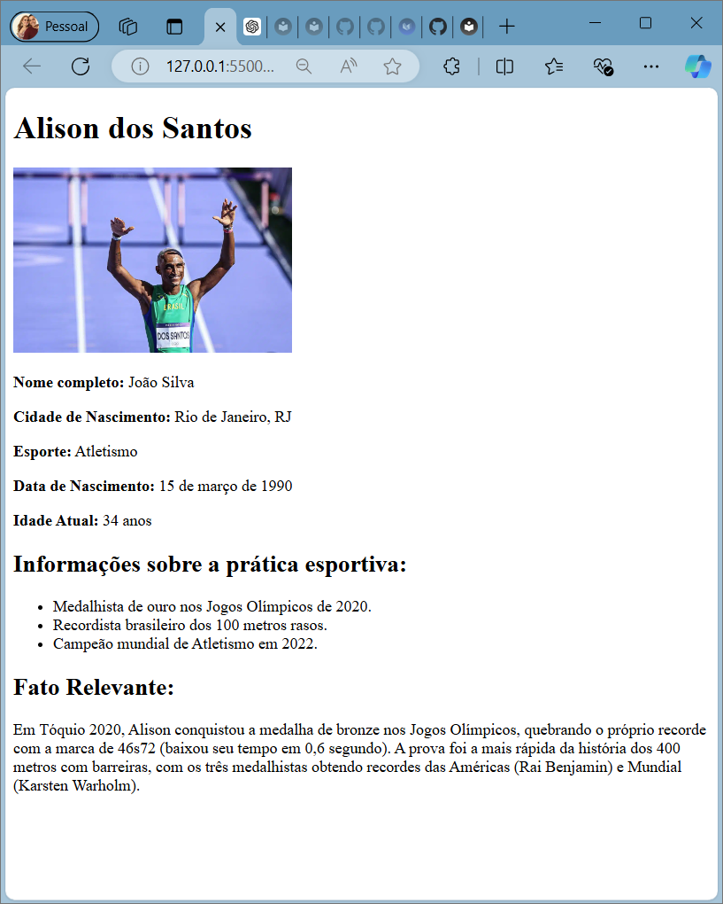
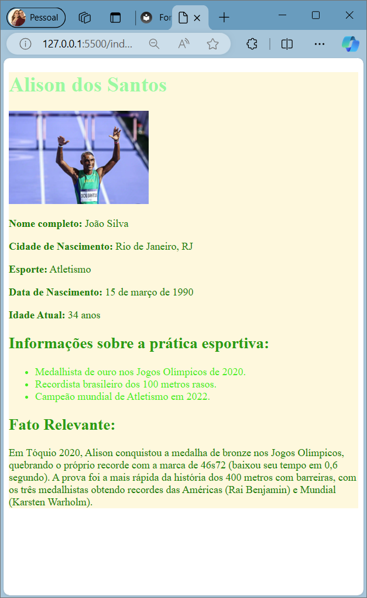
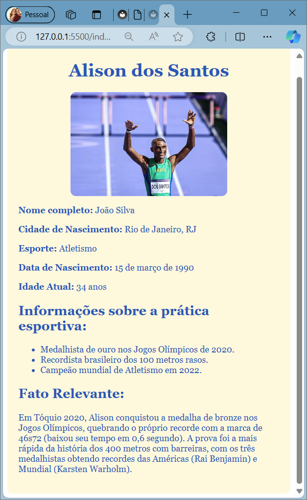

# Introdução ao CSS

Acesse o site da Fundação Mozilla e leia este artigo: <a href="https://developer.mozilla.org/pt-BR/docs/Learn/Getting_started_with_the_web/CSS_basics" target="_blank">CSS básico</a>


## Aula 1

Instruções:

1 - Baixe o arquivo HMTL <a href="https://github.com/CTInternet/arquivos/blob/main/intro-personalizacao-css.zip" target="_blank">Personalização com CSS</a>


2 - Salve em uma pasta e em seguida abra-a com o VScode.

3 - Ao abrir o arquivo ``index.html`` haverá uma página semelhante a que você construiu nas aulas anteriores. Ela deve ter o seguinte aspecto:



Código usado na aula anterior:

```css
    div {
        color: #f2a176
    }
    p {
        color: #566965
    }
    h1 {
        color: #ff7373
    }

```
___


## Aula 2
### CSS Externo e Personalização de Estilos

**O que é CSS Externo?**

É um método de aplicar estilos a uma página da internet, por meio de arquivo com extensão .css e "linká-lo" arquivo HTML

**Como ligar o arquivo CSS ao arquivo HTML**

- Com o software `VSCode` abra a *pasta* do projeto `intro-personalizacao-css`, (aula anterior) e crie um novo arquivo com o seguinte nome: `stylesheet.css`.

- No arquivo `index.html` dentro da tag `head` insira o código abaixo:

    ```html

        <link rel="stylesheet" href="stylesheet.css">
 
    ```

- Abra o arquivo `stylesheet.css`


### Personalizando a Cor das Tags 

```css
p {
    color: #008000
}

h1 {
    color: rgb(145, 250, 159)
}

h2 {
    color: #089d08;
}

ul {
    color: #0cf00c;
}

div {
    /* Define uma cor de fundo para o elemento */
    background-color: #fff8dc;
}
```

Ao concluir as etapas acima, você deverá ter o seguinte resultado:




## Ajuste de aspecto e harmonia de exibição

Para melhorar a exibição da página (layout) será preciso readaptar o código `css`. Vamos às mudanças:

````css
* {
    color: #0c59b8;
    font-family: Georgia;
}

h1 {
    text-align: center;
}

img {
    border-radius: 10px;
    margin: auto;
    display: block;
}

div {
    /* Define uma cor de fundo para o elemento */
    background-color: #fff8dc;
	/* Cria uma borda arredondada com o tamanho de  8 pixels */
    border-radius: 8px;
	/*Cria uma margem entre a div e o texto*/
    padding: 20px;
}
````

Agora temos esta exibição:




